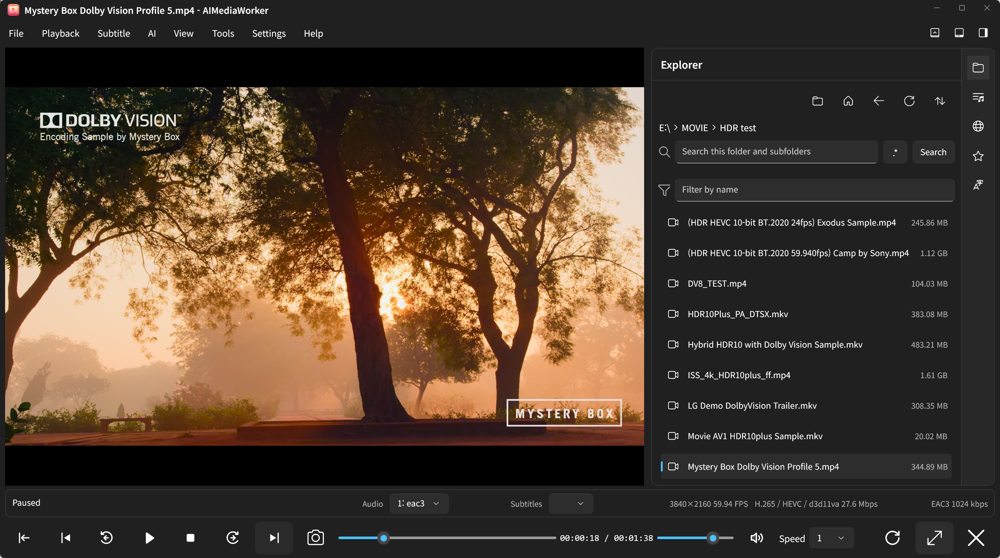

# AIMediaWorker



AIMediaWorker is a Windows 10/11 desktop media player and subtitle workstation built with WinUI 3, .NET 10, libmpv, FFmpeg, and the prebuilt CrispASR native runtime loaded directly from C#.

It plays local files, HTTP/HTTPS streams, HLS/DASH sources, and WebDAV media; imports SRT/WebVTT/ASS/SAMI subtitles and edits them on a timeline; captures screenshots and records the desktop with system audio (optional capture only launch); creates offline or live captions with Qwen3-ASR; and translates or summarizes transcripts through local and cloud LLM providers.

Media files can be opened through the picker, command line, folder explorer, playlist, or drag and drop. The side panel contains Explorer, Playlist, WebDAV, and Subtitles tabs.

## 📥 Download
You can download the latest portable version with libmpv from the [Releases Page](https://github.com/kirinonakar/AIMediaWorker/releases).

## Automatic speech recognition setup

Open **Settings → Automatic speech recognition** and choose **Install**. The
installer checks the components below and installs everything that is missing
in one go; components that are already present are skipped:

- **FFmpeg and FFprobe** → downloaded to `asr-worker\ffmpeg` (a system `PATH`
  installation is used instead when present)
- **CrispASR runtime** → downloaded to `asr-worker\crispasr`
- **Qwen3 ASR and aligner models** → `Qwen3-ASR-1.7B-Q8_0.gguf` (CrispASR
  single-file `qwen3asr` Q8_0 model) and `qwen3-forced-aligner-0.6b-q8_0.gguf`
  downloaded to `asr-worker\models`

The `asr-worker` folder defaults to `asr-worker` beside the executable, and
leaving the **asr-worker folder** box empty in **Settings → Automatic speech
recognition** keeps that default. Pointing the box at another folder makes the
runtime, FFmpeg, and models load from (and install into) that folder instead.
A system `PATH` FFmpeg still takes priority and is not downloaded again.

In **Settings → Automatic speech recognition**, configure: Device (`Auto`,
`Cpu`, `Cuda`), precision, VAD, language, and chunk duration. Manual setup
instructions for each component follow below.

## Requirements

- Windows 10 version 1809 or newer; Windows 11 is recommended.
- x64 [.NET 10 SDK](https://dotnet.microsoft.com/download/dotnet/10.0).
- Visual Studio with the Windows App SDK workload, or the `dotnet` CLI.
- x64 libmpv with its dependent DLLs.
- FFmpeg and FFprobe 6 or newer on `PATH`.
- The prebuilt native CrispASR runtime under `asr-worker/crispasr`.
- For practical Qwen inference: an NVIDIA CUDA GPU with current drivers and enough VRAM. CPU mode is supported but substantially slower.

The application does not bundle libmpv, FFmpeg, model weights, credentials, or API keys.
The Windows App SDK runtime is deployed self-contained with the application, so the unpackaged executable does not require a separately registered Windows App Runtime.

## Build and run

```powershell
dotnet restore AIMediaWorker.slnx
dotnet build AIMediaWorker.slnx -c Debug
dotnet run --project AIMediaWorker/AIMediaWorker.csproj -c Debug -p:Platform=x64
```

Release validation:

```powershell
dotnet build AIMediaWorker.slnx -c Release
dotnet test tests/AIMediaWorker.Tests/AIMediaWorker.Tests.csproj -c Release
```

## libmpv setup

The [official mpv installation page](https://mpv.io/installation/) lists maintained Windows binary providers. AIMediaWorker needs the embeddable **libmpv development build**, not the normal `mpv.exe` player archive.

1. Open the [shinchiro Windows build releases](https://github.com/shinchiro/mpv-winbuild-cmake/releases).
2. From the newest release, download `mpv-dev-x86_64-<date>-git-<commit>.7z`.
   - Choose a file containing both `dev` and `x86_64`.
   - Do not download the similarly named `mpv-x86_64-...` player archive.
   - The build without `-v3` has the broadest CPU compatibility. The `-v3` variant is appropriate only for CPUs supporting the x86-64-v3 instruction set.
3. Optionally compare the downloaded file's SHA-256 hash with the value shown next to the GitHub release asset.
4. Extract the `.7z` archive with [7-Zip](https://www.7-zip.org/).
5. Copy `libmpv-2.dll` from the archive into the repository-level `Libs` folder and rename it to `mpv-2.dll`:

   ```text
   AIMediaWorker/
   ├─ Libs/
   │  └─ mpv-2.dll
   ├─ AIMediaWorker/
   └─ AIMediaWorker.slnx
   ```

6. If the downloaded build supplies additional runtime DLLs, place those DLLs in `Libs` as well.
7. Build the application. Every DLL directly inside `Libs` is copied beside `AIMediaWorker.exe` for Debug, Release, and publish output.

AIMediaWorker uses mpv's `gpu-next` D3D11 renderer and `auto-safe` hardware decoding by default. HDR output automatically negotiates a 10-bit color space on supported Windows displays and can be changed in Preferences.

Dolby Vision Profile 4 and 8 use compatible base-layer fallbacks when needed. RTX Video Super Resolution is skipped for HDR and Dolby Vision content in Auto mode to preserve color accuracy.

When RTX Video Super Resolution is set to Auto or On, AIMediaWorker adds mpv's `d3d11vpp` filter with `scaling-mode=nvidia` and a 2x scale request to the D3D11 video path. NVIDIA App/Control Panel must still allow RTX Video enhancement for AIMediaWorker; the driver decides whether each frame is enhanced. Playback falls back to mpv's normal scaler when the filter is disabled or unavailable.

## FFmpeg setup

Verify the installation:

```powershell
ffmpeg -version
ffprobe -version
```

FFmpeg is used as the audio extractor for ASR. Child processes are terminated
when work is cancelled.

## Native Qwen3 and CrispASR setup

### Install the CrispASR runtime

AIMediaWorker uses CrispASR in-process through its C ABI. Download the full
Windows CUDA **lib** bundle below. The currently tested runtime is CrispASR
v0.8.29:

- [Download `libcrispasr-windows-x86_64-cuda.tar.gz`](https://github.com/CrispStrobe/CrispASR/releases/download/v0.8.29/libcrispasr-windows-x86_64-cuda.tar.gz)
- [View all CrispASR releases](https://github.com/CrispStrobe/CrispASR/releases)

The full bundle is self-contained and includes `crispasr.dll`, the `ggml`
backend DLLs, and the CUDA runtime DLLs.

On Windows, extract the downloaded `.tar.gz` twice if required by the archive
tool, then copy every DLL from its `bin` directory into the repository's
`asr-worker\crispasr` directory. With PowerShell, when the archive is in the
repository root:

```powershell
tar -xzf .\libcrispasr-windows-x86_64-cuda.tar.gz
New-Item -ItemType Directory -Force .\asr-worker\crispasr | Out-Null
Copy-Item .\libcrispasr-windows-x86_64-cuda\bin\*.dll .\asr-worker\crispasr\ -Force
```

The resulting layout must be flat; native dependencies must be beside
`crispasr.dll`:

```text
asr-worker/
└─ crispasr/
   ├─ crispasr.dll
   ├─ ggml-base.dll
   ├─ ggml-cpu.dll
   ├─ ggml-cuda.dll
   ├─ ggml.dll
   ├─ cudart64_*.dll
   ├─ cublas64_*.dll
   └─ cublasLt64_*.dll
```

The CrispASR runtime and model storage paths are fixed below
the executable's `asr-worker` directory.

Offline processing extracts bounded chunks, applies a native amplitude gate when VAD is enabled, restores global microsecond timestamps, uses the CrispASR forced aligner, and emits subtitles before the complete file finishes. The live path uses a bounded rolling PCM window because the Qwen3 C ABI is consumed through synchronous session calls.

## Subtitle workflow

1. Open a media file or URL.
2. Load SRT, WebVTT, ASS, or SSA, or let mpv select an embedded/sidecar track.
3. Edit text and microsecond timestamps, split/merge/duplicate/shift cues, or drag/resize cues on the timeline.
4. Use **AI → Generate subtitles**, **Translate**, or **Summarize** as needed.
5. Save as SRT, VTT, or ASS. Converting a styled format to a simpler format shows a style-loss notice while preserving text and timing.

The subtitle encoding setting supports UTF-8 and installed Windows code pages. Editor changes are mirrored to mpv through a debounced temporary ASS overlay and are protected by save/discard prompts.

## Camera and live captions

Open **Tools → Camera and live captions**:

1. Select a camera, microphone, and supported camera format.
2. Start preview; optionally save MP4 capture.
3. Configure Qwen first, then start live captions.

Microphone audio is captured through WASAPI, resampled to 16 kHz mono PCM, and passed through bounded drop-oldest channels. Partial captions are visually dimmed; final captions are fully opaque. Windows loopback captions decode a rolling window every second, keep the recent ASR tail editable, and send only newly committed clause-sized deltas to the translation model. Streaming translation tokens are rendered immediately; an idle flush handles stable text that has not yet reached punctuation. Font, size, colors, position, and maximum lines are configurable under Capture defaults. Windows camera/microphone privacy settings must permit desktop access.

## Screen capture and recording

Open **Tools → Capture & record**, then choose **Capture** or **Record** and a
**Full screen**, **Window**, or **Region** target. The draggable overlay provides
recording pause/resume and stop controls; press `Esc` to cancel target selection.

Screenshots are saved as PNG. Recordings are saved as H.264 MP4 files with AAC
stereo audio from the default Windows playback device. OCR recognizes a selected
area and copies its text to the clipboard. Files are written to the default folder
configured in Settings.

### Scroll capture

Enable **Scroll capture** on the overlay and choose a **Window** target:
AIMediaWorker scrolls the window from the top, captures newly exposed areas,
and stitches them into a single tall PNG, then restores the scroll position.

### VLM OCR

Enable **VLM OCR** to recognize text with a vision language model instead of
the local OCR engine. The selected region is sent to the LLM provider and
model configured in Settings, and the recognized text with its translation is
copied to the clipboard. VLM OCR and **Translate OCR** are mutually exclusive.

### Voice typing

Press the microphone button to the right of **VLM** and wait for the ready
message. Then click the desired input field in another app and start speaking.
Speech is recognized in real time and inserted at that cursor position; press
the microphone button again to stop. This uses the ASR model, language, and
microphone configured in Settings.

### Capture only launch
To launch only the capture and recording overlay, run:

```powershell
AIMediaWorker.exe -capture
```

This command does not open the main window. When the overlay has focus, pressing
`Esc` closes the overlay and terminates the capture-only process. While selecting
a window or region, `Esc` cancels only the current selection and returns to the
overlay.

## LLM providers

Supported provider profiles:

- **Local**: Unsloth Desktop, Ollama, and LM Studio
- **Cloud**: Google Gemini, Ollama Cloud, OpenCode Go, and OpenCode Zen

API keys are stored in Windows Credential Manager.

## Keyboard shortcuts

| Gesture | Action |
|---|---|
| Space | Play/pause |
| Ctrl+B / Ctrl+F | Previous/next media |
| Ctrl+1 / Ctrl+2 / Ctrl+3 | Toggle timeline/status bar/side panel |
| Left / Right | Seek by the configured interval |
| Up / Down | Volume ±5 |
| M | Mute/unmute |
| V | Show/hide subtitles |
| Ctrl+Left / Ctrl+Right | Previous/next subtitle |
| Ctrl+S / Ctrl+Shift+S | Save/Save As |
| Ctrl+Z / Ctrl+Y | Undo/redo |
| Delete | Delete selected cues |
| Ctrl+W | Close the application |
| Enter / F / F11 | Toggle fullscreen |
| Esc | Leave fullscreen |
| Home / End | Seek to start/end |
| Backspace / Ctrl+Shift+N | Play the current media from the beginning |

Double-clicking the video surface toggles play/pause.

## Settings, data, and diagnostics

Per-user data is stored below `%LOCALAPPDATA%\AIMediaWorker`:

- `settings.json`: atomically replaced application settings.
- `recent.json`: recent media and playback positions.
- `favorites.json`: favorite media and folders.
- `Logs\app.jsonl`: size-rotated structured diagnostics without credentials.

The UI supports English, 한국어, and 日本語 resources plus System/Light/Dark themes.

## License

Unless stated otherwise, AIMediaWorker source code is licensed under the [GNU General Public License v2.0 or later](https://www.gnu.org/licenses/old-licenses/gpl-2.0.html) (`GPL-2.0-or-later`). See [LICENSE](LICENSE). This project license does not replace the separate licenses for the third-party components listed below.

## Third-party licenses

AIMediaWorker uses, links to, or can download third-party software, native runtimes, and model weights. Those components remain under their own licenses. When redistributing a build, preserve the license and notice files supplied with each corresponding component. The ASR installer also copies matching `LICENSE*`, `THIRD_PARTY*`, and `README*` files from downloaded FFmpeg and CrispASR archives.

| Component | Use | License / notice |
|---|---|---|
| [Microsoft Windows App SDK](https://github.com/microsoft/WindowsAppSDK) 2.4.0 and related Microsoft SDK packages | WinUI runtime and Windows integration | Microsoft Software License Terms plus the package `license.txt` and `NOTICE.txt` files. |
| [Microsoft Windows SDK Build Tools](https://aka.ms/WinSDKProjectURL) 10.0.28000.2526 | Build and packaging | Microsoft Windows SDK license terms. |
| [System.Security.Cryptography.ProtectedData](https://github.com/dotnet/dotnet) 10.0.0 | Windows Credential Manager protection | MIT. |
| [NAudio](https://github.com/naudio/NAudio) 2.2.1 | WASAPI microphone and system-audio loopback capture | MIT; see the package `license.txt`. |
| [mpv/libmpv](https://github.com/mpv-player/mpv) | Media playback | GPLv2 or later by default. The exact binary distribution and its bundled libraries may carry additional notices. |
| [FFmpeg](https://ffmpeg.org/legal.html) / FFprobe | ASR audio extraction | LGPLv2.1 or later by default; optional GPL components can change the terms. Follow the license files included with the downloaded build. |
| [CrispASR](https://github.com/CrispStrobe/CrispASR) native runtime | Qwen3 ASR and forced alignment | CrispASR itself is MIT; its bundled dependencies and notices remain separately licensed. |
| [Qwen3-ASR-1.7B GGUF](https://huggingface.co/cstr/qwen3-asr-1.7b-GGUF) and [Qwen3-ForcedAligner-0.6B GGUF](https://huggingface.co/cstr/qwen3-forced-aligner-0.6b-GGUF) | Downloaded ASR model weights | Apache-2.0 according to the respective model cards. Model-specific terms still apply. |
| [Microsoft.NET.Test.Sdk](https://github.com/microsoft/vstest) 18.0.1 | Test-only dependency | MIT. |
| [xUnit](https://github.com/xunit/xunit) 2.9.3 and [xunit.runner.visualstudio](https://github.com/xunit/visualstudio.xunit) 3.1.5 | Test-only dependencies | Apache-2.0. |

Transitive NuGet dependencies are governed by their own package license and notice files as well. In particular, review the `NOTICE.txt` and `license.txt` files shipped in the Microsoft Windows App SDK package when redistributing its runtime.
